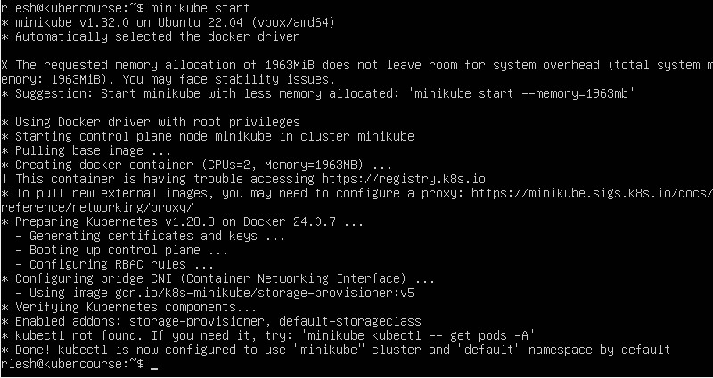
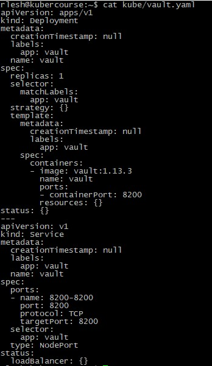
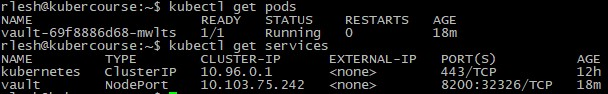
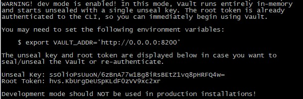
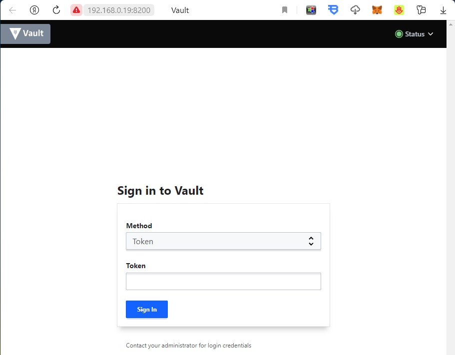
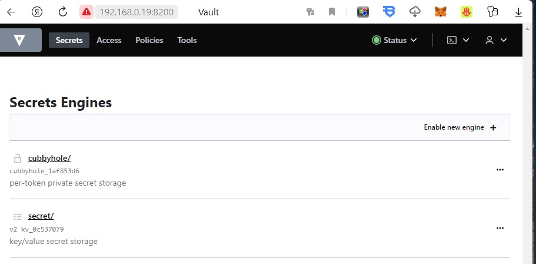
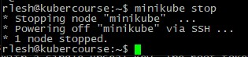

University: [ITMO University](https://itmo.ru/ru/)  
Faculty: [FICT](https://fict.itmo.ru)  
Course: [Introduction to distributed technologies](https://github.com/itmo-ict-faculty/introduction-to-distributed-technologies)  
Year: 2023/2024  
Group: K4111c  
Author: Leshkov Roman Sergreevich  
Lab: Lab1  
Date of create: 30.11.2023  
Date of finished: 30.11.2023  

Ход лабораторной работы:

1. Для начала установлены Docker и Minikube согласно документациям
### docker
#### set up the docker repository
  
    sudo apt-get update
    sudo apt-get install ca-certificates curl gnupg
    sudo install -m 0755 -d /etc/apt/keyrings
    curl -fsSL https://download.docker.com/linux/ubuntu/gpg | sudo gpg --dearmor -o /etc/apt/keyrings/docker.gpg
    sudo chmod a+r /etc/apt/keyrings/docker.gpg
    echo \
      "deb [arch=$(dpkg --print-architecture) signed-by=/etc/apt/keyrings/docker.gpg] https://download.docker.com/linux/ubuntu \
      $(. /etc/os-release && echo "$VERSION_CODENAME") stable" | \
      sudo tee /etc/apt/sources.list.d/docker.list > /dev/null
    sudo apt-get update
  
#### install docker

    sudo apt-get install docker-ce docker-ce-cli containerd.io docker-buildx-plugin docker-compose-plugin

#### non-root user for docker

    sudo usermod -aG docker $USER

#### boot docker with systemd

    sudo systemctl enable docker.service
    sudo systemctl enable containerd.service
### minikube
#### install minikube
    curl -LO https://storage.googleapis.com/minikube/releases/latest/minikube-linux-amd64
    sudo install minikube-linux-amd64 /usr/local/bin/minikube
#### download kubectl via minikube and get list of pods
    minikube kubectl -- get po -A
#### set alias
    alias kubectl="minikube kubectl --"
2. Далее запускается кластер minikube

        minikube start
   

3. Написан kubernetes манифест для развертывания пода с образом HashiCorp Vault, с доступом к сервису на порту 8200.

        kubectl create deployment vault --image=vault:1.13.3 -o yaml --port=8200 --dry-run > kube/vault.yaml

 Манифест - описание ресурсов(развертывание, сервисы, поды), которые должны быть созданы, как эти ресурс должны исполняться внутри кластера.

 4. Манифест дополнен созданием сервиса для доступа к подам vault через порт 8200

        echo --- >> kube/vault.yaml
        kubectl create service nodeport vault --tcp=8200:8200 -o yaml --dry-run >> kube/vault.yaml

5. Применен манифест. В итоге запущен под vault и сервис vault

        kubectl apply -f kube/vault.yaml 

6. Для доступа сервиса вне кластера прокинут порт 8200

      minikube kubectl -- port-forward service/vault --address 0.0.0.0 8200:8200
  
7. Для доступа к vault необходимо взять токен рута из логов пода

        kubectl logs services/vault

8. В браузере открыт сервис и введен токен. Доступ получен

9. Кластер остановлен

        minikube stop

Ответы на вопросы:

1. Что сейчас произошло и что сделали команды указанные ранее?
Написан манифест с развертыванием одного пода с образом Vault и одного сервиса для доступа к кластеру через порт 8200. Применен манифест, прокинут порт для доступа к vault извне.

2. Где взять токен для входа в Vault?
Токен взят из логов
