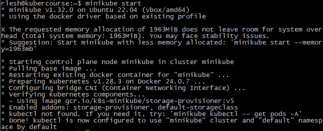

University: [ITMO University](https://itmo.ru/ru/)  
Faculty: [FICT](https://fict.itmo.ru)  
Course: [Introduction to distributed technologies](https://github.com/itmo-ict-faculty/introduction-to-distributed-technologies)  
Year: 2023/2024  
Group: K4111c  
Author: Leshkov Roman Sergreevich  
Lab: Lab2  
Date of create: 30.11.2023  
Date of finished: 30.11.2023  

Ход лабораторной работы:

1. Запускается кластер minikube

        minikube start

   
2. Создан манифест с выбранным образом и 2 репликами

        kubectl create deployment lab2 --image=ifilyaninitmo/itdt-contained-frontend:master -o yaml --port=3000 -r 2 --dry-run > kube/lab2.yaml

3. Создан сервис для доступа вне кластера
  
        echo --- >> kube/lab2.yaml
        kubectl create service nodeport lab2 --tcp=80:3000 -o yaml --dry-run >> kube/lab2.yaml

4. В манифест добавляются две переменные окружения: в файл lab2.yaml в spec.template.spec.containers.image дабаляется пункт env.

      env:
        - name: REACT_APP_USERNAME
          value: "Roman Leshkov"
        - name: REACT_APP_COMPANY_NAME
          value: "ITMO"

5. Применяется написанный манифест

        kubectl apply -f kube/lab2.yaml

6. Пробрасывается порт

        minikube kubectl -- port-forward service/lab2 --address 0.0.0.0 8080:80

7. Проверяется доступ через браузер

Указанные в манифесте переменные отображены на полученной странице, также указаны ip-адрес пода и его имя. Имя и ip могут поменяться, если запрос будет обрабатывать второй под.

Логи пода

