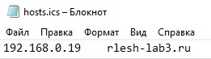

University: [ITMO University](https://itmo.ru/ru/)  
Faculty: [FICT](https://fict.itmo.ru)  
Course: [Introduction to distributed technologies](https://github.com/itmo-ict-faculty/introduction-to-distributed-technologies)  
Year: 2023/2024  
Group: K4111c  
Author: Leshkov Roman Sergreevich  
Lab: Lab3  
Date of create: 30.11.2023  
Date of finished: 06.12.2023  

Ход лабораторной работы:

1. Запускается кластер minikube

        minikube start
        alias kubectl="minikube kubectl --"

2. Включается аддон для ingress, который запускает поды и сервисы, нужные для работы ingress-контроллера

        minikube addons enable ingress

3. Создан манифест для configMap содержащий пары ключ-значение для других манифестов

        kubectl create configmap lab3-configmap --from-literal=REACT_APP_USERNAME="Roman Leshkov"  --from-literal=REACT_APP_COMPANY_NAME="ITMO" -o yaml --dry-run > kube/lab3-configmap.yaml

4. Создан манифест для создания replicaSet. Так как нет команды "create replicaset", манифест был создан на базе "create deployment" с последующей заменой типа и добавлением переменных из конфиг-мапа.

        kubectl create deployment lab3 --image=ifilyaninitmo/itdt-contained-frontend:master -o yaml --port=3000 -r 2 --dry-run | sed 's/Deployment/ReplicaSet/g' | sed '/strategy/d' | sed 's/resources/env:\n        - name: REACT_APP_USERNAME\n          valueFrom:\n            configMapKeyRef:\n              name: lab3-configmap\n              key: REACT_APP_USERNAME\n        - name: REACT_APP_COMPANY_NAME\n          valueFrom:\n            configMapKeyRef:\n              name: lab3-configmap\n              key: REACT_APP_COMPANY_NAME\n        resources/g' > kube/lab3-replicaset.yaml

5. Создан манифест для сервиса, который нужен для доступа к реплика-сету внутри кластера

        kubectl create service nodeport lab3 --tcp=3000:3000 -o yaml --dry-run > kube/lab3-service.yaml

6. Сгенерирован TLS сертификат и ключ для FQDN rlesh-lab3.ru

        openssl req -newkey rsa:4096 -x509 -sha256 -days 365 -nodes -out minikube.crt -keyout minikube.key -subj /C=RU/L=Saint-Petersberg/O=ITMO/OU=FICT/CN=rlesh-lab3.ru/emailAddress=leshkovr@gmail.com

7. Создан манифест для secret tls, с указанием ранее созданного TLS сертификата и ключа

        kubectl create secret tls lab3-tls --cert minikube.crt --key minikube.key --dry-run -o yaml > kube/lab3-tls.yaml

8. Создан манифест для ingress, с указанием правила: при обращении на rlesh-lab3.ru с прификсом "/", направлять запрос через сервис lab3 на порт 3000. Также указывается secret tls с сертификатом и ключем

        kubectl create ingress lab3 --dry-run -o yaml --rule=rlesh-lab3.ru/*=lab3:3000,tls=lab3-tls > kube/lab3-ingress.yaml

9. Применяются ранее созданные манифесты

        kubectl apply -f kube/lab3-configmap.yaml
        kubectl apply -f kube/lab3-replicaset.yaml
        kubectl apply -f kube/lab3-service.yaml
        kubectl apply -f kube/lab3-tls.yaml
        kubectl apply -f kube/lab3-ingress.yaml

10. При обращении к ingress запрос проходит через ingress-контроллер, так что, чтобы получить доступ к ingress из-вне кластера, нужно прокинуть порт для ingress-контроллера

        sudo sysctl net.ipv4.ip_unprivileged_port_start=443
        kubectl port-forward service/ingress-nginx-controller --address 0.0.0.0 443:443 --namespace ingress-nginx

12. Проверен доступ к ingress и сертификат. Для этого в файл hosts был добавлен адрес ВМ с minikube и FQDN

Схема:
