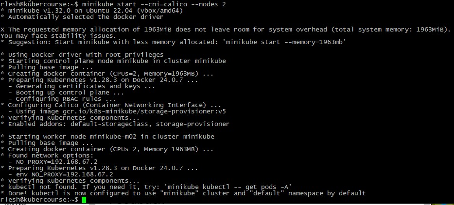
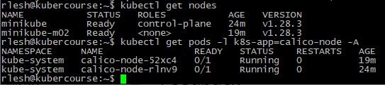
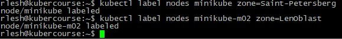
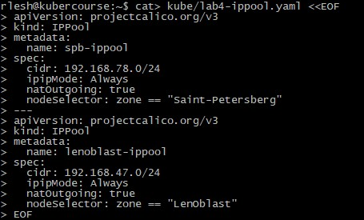
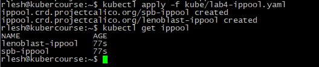
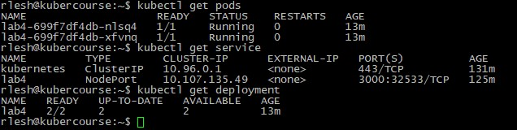
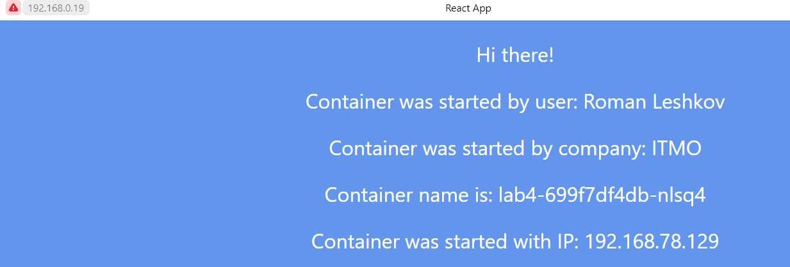
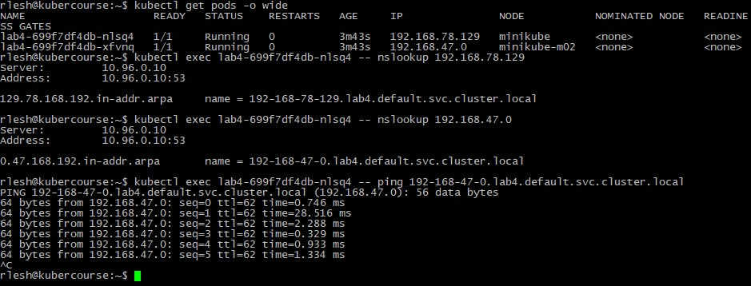
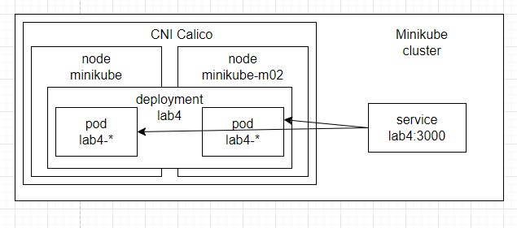

University: [ITMO University](https://itmo.ru/ru/)  
Faculty: [FICT](https://fict.itmo.ru)  
Course: [Introduction to distributed technologies](https://github.com/itmo-ict-faculty/introduction-to-distributed-technologies)  
Year: 2023/2024  
Group: K4111c  
Author: Leshkov Roman Sergreevich  
Lab: Lab4  
Date of create: 06.12.2023  
Date of finished: 06.12.2023  

Ход лабораторной работы:

1. Запущен кластер minikube с двумя нодами и CNI calico 

       minikube start --cni=calico --nodes 2
       alias kubectl="minikube kubectl --"

2. Две ноды запушены, подтверждена работа calico

       kubectl get nodes
       kubectl get pods -l k8s-app=calico-node -A

Исправление статуса ready 0/1

(Для исправления статуса ready 0/1 calico был переустановлен)

       kubectl delete -f https://docs.projectcalico.org/manifests/calico.yaml
       wget https://docs.projectcalico.org/manifests/calico.yaml

В calico.yaml внесены изменения

        # Auto-detect the BGP IP address.
        - name: IP
           value: "autodetect"
        - name: IP_AUTODETECTION_METHOD
           value: "interface=ens*"

Снова запущен calico

       kubectl apply -f calico.yaml

3. Назначены метки zone для нод

       kubectl label nodes minikube zone=Saint-Petersberg
       kubectl label nodes minikube-m02 zone=LenOblast

4. Устаноавлен calico API server для управления  calico через kubectl

       kubectl create -f https://raw.githubusercontent.com/projectcalico/calico/v3.26.4/manifests/apiserver.yaml
       openssl req -x509 -nodes -newkey rsa:4096 -keyout apiserver.key -out apiserver.crt -days 365 -subj "/" -addext "subjectAltName = DNS:calico-api.calico-apiserver.svc"
       kubectl create secret -n calico-apiserver generic calico-apiserver-certs --from-file=apiserver.key --from-file=apiserver.crt
       kubectl patch apiservice v3.projectcalico.org -p \
            "{\"spec\": {\"caBundle\": \"$(kubectl get secret -n calico-apiserver calico-apiserver-certs -o go-template='{{ index .data "apiserver.crt" }}')\"}}"

5. Удален стандартный ippoool

       kubectl get ippool
       kubectl delete ippools default-ipv4-ippool

6. Написан манифест для создания двух ippool'ов, которые применяются в зависимости от метки zone на ноде

       cat> kube/lab4-ippool.yaml <<EOF
       apiVersion: projectcalico.org/v3
       kind: IPPool
       metadata:
         name: spb-ippool
       spec:
         cidr: 192.168.78.0/24
         ipipMode: Always
         natOutgoing: true
         nodeSelector: zone == "Saint-Petersberg"
       ---
       apiVersion: projectcalico.org/v3
       kind: IPPool
       metadata:
         name: lenoblast-ippool
       spec:
         cidr: 192.168.47.0/24
         ipipMode: Always
         natOutgoing: true
         nodeSelector: zone == "LenOblast"
       EOF

7. Применен созданный маниест для создания двух ippool'ов

       kubectl apply -f kube/lab4-ippool.yaml

8. Созданы lab4-configmap, deployment lav4 и service lab4 для поднятия двух подов

       kubectl create configmap lab4-configmap --from-literal=REACT_APP_USERNAME="Roman Leshkov"  --from-literal=REACT_APP_COMPANY_NAME="ITMO" -o yaml --dry-run > kube/lab4-configmap.yaml
       kubectl create deployment lab4 --image=ifilyaninitmo/itdt-contained-frontend:master -o yaml --port=3000 -r 2 --dry-run | sed 's/resources/env:\n        - name: REACT_APP_USERNAME\n          valueFrom:\n            configMapKeyRef:\n              name: lab4-configmap\n              key: REACT_APP_USERNAME\n        - name: REACT_APP_COMPANY_NAME\n          valueFrom:\n            configMapKeyRef:\n              name: lab4-configmap\n              key: REACT_APP_COMPANY_NAME\n        resources/g' > kube/lab4-deployment.yaml
       kubectl create service nodeport lab4 --tcp=3000:3000 -o yaml --dry-run > kube/lab4-service.yaml
       kubectl apply -f kube/lab4-configmap.yaml
       kubectl apply -f kube/lab4-deployment.yaml
       kubectl apply -f kube/lab4-service.yaml

9. Прокинут порт для доступа к сервису 

       sudo sysctl net.ipv4.ip_unprivileged_port_start=80
       kubectl port-forward service/lab4 --address 0.0.0.0 80:3000

10. Проверен доступ к сервису

11. Проверена связь подов через calico

        kubectl exec lab4-699f7df4db-nlsq4 -- nslookup 192.168.78.129  
        kubectl exec lab4-699f7df4db-nlsq4 -- nslookup 192.168.47.0  
        kubectl exec lab4-699f7df4db-nlsq4 -- ping 192-168-47-0.lab4.default.svc.cluster.local  

Схема

